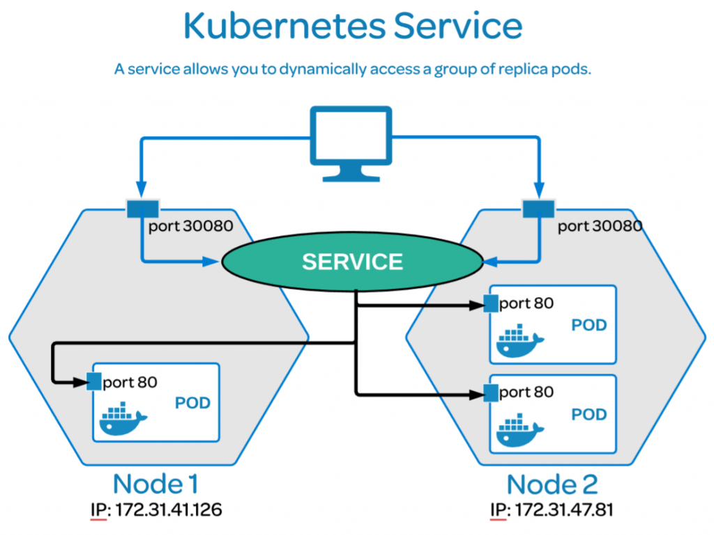
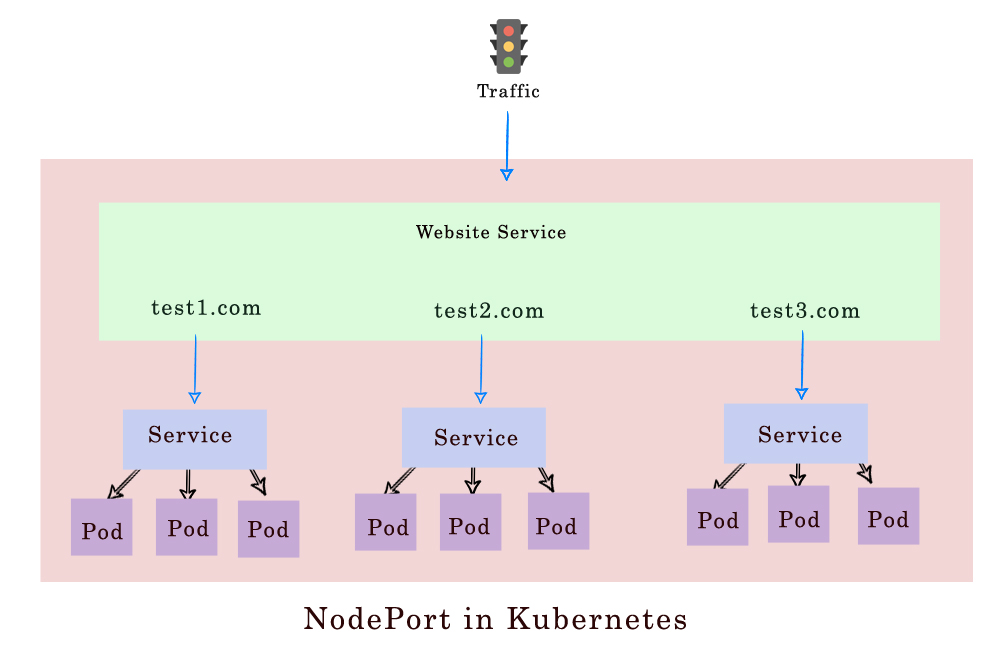

# Kubernetes Services Types 
## What is a Service?

According to Wikipedia, microservice architecture arranges an application as a collection of loosely coupled services. In a microservices architecture, services are fine-grained and the protocols are lightweight. 

Services in a microservice architecture (MSA) are often processes that communicate over a network to fulfill a goal using technology-agnostic protocols such as HTTP. 

Let’s imagine that you are writing some code that invokes a service that has a REST API. In order to make a request, your code needs to know the network location (IP address and port) of a service instance. In a traditional application running on physical hardware, the network locations of service instances are relatively static. For example, your code can read the network locations from a configuration file that is occasionally updated.

In a modern, cloud‑based microservices application, however, this is a much more difficult problem to solve. Service instances have dynamically assigned network locations. Moreover, the set of service instances changes dynamically because of autoscaling, failures, and upgrades. Consequently, your client code needs to use a more elaborate service discovery mechanism.

In a Kubernetes cluster, each Pod has an internal IP address. But the Pods in a Deployment come and go, and their IP addresses change. So it doesn't make sense to use Pod IP addresses directly. With a Service, you get a stable IP address that lasts for the life of the Service, even as the IP addresses of the member Pods change.

A Service also provides load balancing. Clients call a single, stable IP address, and their requests are balanced across the Pods that are members of the Service.

The image below depicts a kubernetes service.

# Overview

## Types of Services
There are five types of Kubernetes Services:

*  ClusterIP (default): Internal clients send requests to a stable internal IP address.

*  NodePort:  Clients send requests to the IP address of a node on one or more nodePort values that are specified by the Service.

*  LoadBalancer:  Clients send requests to the IP address of a network load balancer.

*  ExternalName:  Internal clients use the DNS name of a Service as an alias for an external DNS name.

*  Headless:  You can use a headless service in situations where you want a Pod grouping, but don't need a stable IP address.

The NodePort type is an extension of the ClusterIP type. So a Service of type NodePort has a cluster IP address.

The LoadBalancer type is an extension of the NodePort type. So a Service of type LoadBalancer has a cluster IP address and one or more nodePort values.

## How to use a Service 
A Service in Kubernetes is a REST object, similar to a Pod. Like all of the REST objects, you can POST a Service definition to the API server to create a new instance. The name of a Service object must be a valid DNS label name.

For example, suppose you have a set of Pods that each listen on TCP port 9376 and carry a label app=MyApp:

    apiVersion: v1
    kind: Service
    metadata:
    name: my-service
    spec:
    selector:
        app: MyApp
    ports:
        - protocol: TCP
        port: 80
        targetPort: 9376

You can save this into a yaml file, say, my-service.yaml. You can run this as a service as:

    kubectl create -f my-service

This will create a service and you can check it as:

    kubectl get svc 

Let's create examples of each type of service.

### ClusterIP Service
When you create a Service of type ClusterIP, Kubernetes creates a stable IP address that is accessible from nodes in the cluster.

    apiVersion: v1
    kind: Service
    metadata:
    name: my-cip-service
    spec:
    selector:
        app: metrics
        department: sales
    type: ClusterIP
    ports:
    - protocol: TCP
        port: 80
        targetPort: 8080

You can create the Service by using kubectl apply -f [MANIFEST_FILE]. After you create the Service, you can use kubectl get service to see the stable IP address:

    NAME             TYPE        CLUSTER-IP      EXTERNAL-IP   PORT(S)
    my-cip-service   ClusterIP   10.11.247.213   none          80/TCP

### NordPort Service
When you create a Service of type NodePort, Kubernetes gives you a nodePort value. Then the Service is accessible by using the IP address of any node along with the nodePort value.

Here is a manifest for a Service of type NodePort:

    apiVersion: v1
    kind: Service
    metadata:
    name: my-np-service
    spec:
    selector:
        app: products
        department: sales
    type: NodePort
    ports:
    - protocol: TCP
        port: 80
        targetPort: 8080

External clients call the Service by using the external IP address of a node along with the TCP port specified by nodePort. The request is forwarded to one of the member Pods on the TCP port specified by the targetPort field.

For example, suppose the external IP address of one of the cluster nodes is 203.0.113.2. Then for the preceding example, the external client calls the Service at 203.0.113.2 on TCP port 32675. The request is forwarded to one of the member Pods on TCP port 8080. The member Pod must have a container listening on TCP port 8080.

The NodePort Service type is an extension of the ClusterIP Service type. So internal clients have two ways to call the Service:

* Use clusterIP and port.
* Use a node's internal IP address and nodePort.

### LoadBalancer Service
When you create a Service of type LoadBalancer, a Google Cloud controller wakes up and configures a network load balancer in your project. The load balancer has a stable IP address that is accessible from outside of your project.

Note that a network load balancer is not a proxy server. It forwards packets with no change to the source and destination IP addresses.

Here is a manifest for a Service of type LoadBalancer:

    apiVersion: v1
    kind: Service
    metadata:
    name: my-nlb-service
    spec:
    selector:
        app: metrics
        department: engineering
    type: LoadBalancer
    ports:
    - port: 80
        targetPort: 8080

The LoadBalancer Service type is an extension of the NodePort type, which is an extension of the ClusterIP type.

### ExternalName Service
A Service of type ExternalName provides an internal alias for an external DNS name. Internal clients make requests using the internal DNS name, and the requests are redirected to the external name.

Here is a manifest for a Service of type ExternalName:

    apiVersion: v1
    kind: Service
    metadata:
    name: my-xn-service
    spec:
    type: ExternalName
    externalName: example.com

## Resources 

- [Kubernetes - Services Explained in 15 Minutes!](https://www.youtube.com/watch?v=5lzUpDtmWgM)
    - This tutorial gives a simple description of the various types of services and examples of how to create them.
- [The most succinct resource](https://cloud.google.com/kubernetes-engine/docs/concepts/service)
    - This tutorial gives a simple description of the various types of services and examples of how to create them.
- [The official documentation](https://kubernetes.io/docs/concepts/services-networking/service/)
    - This is a necessary document to know of especially if you are going for kubernetes certifications. You are allowed to use this documentation during the test and nothing else.
- [NodePort vs. Loadbalancer vs. Ingress](https://medium.com/google-cloud/kubernetes-nodeport-vs-loadbalancer-vs-ingress-when-should-i-use-what-922f010849e0)
    - This is a necessary document to know of especially if you are going for kubernetes certifications. You are allowed to use this documentation during the test and nothing else.
- [How does Consul work with Kubernetes and other workloads?](https://www.youtube.com/watch?v=K93ZaUzwEWk&t=4s)
    - This is a necessary document to know of especially if you are going for kubernetes certifications. You are allowed to use this documentation during the test and nothing else.
- [Definitions from Wikipedia](https://en.wikipedia.org/wiki/Microservices)
    - The standard source for definitions.

## Pain Points 

- **Microservice architectures solve some problems but introduce others.** Dividing applications into independent services simplifies development, updates, and scaling. At the same time, it gives you many more moving parts to connect and secure. Managing all of the network services — load balancing, traffic management, authentication and authorization, etc. — can become stupendously complex. There is a collective term for this networked space between the services in your Kubernetes cluster: a service mesh. Istio is one such example of a service mesh. 

